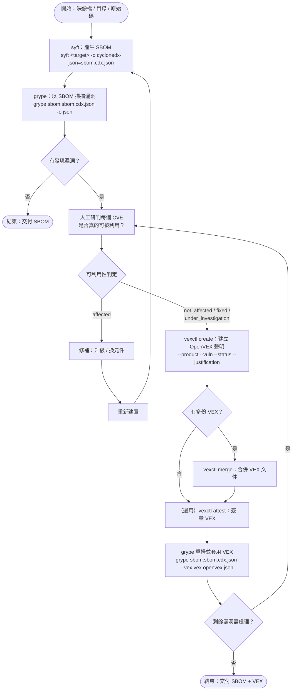

# syft → grype → vexctl 使用順序

## 問題

三個工具如何串接成「產生 SBOM → 掃描漏洞 → 聲明可利用性」的流程？

## 結論（TL;DR）

[[tools/syft-grype|syft]] 產生 SBOM，[[tools/syft-grype|grype]] 以 SBOM 掃描漏洞，經人工研判後用 [[tools/vexctl|vexctl]] 寫 [[concepts/vex|VEX]]，再讓 grype 帶 VEX 重掃。[^g][^v]

## 分析

分工：syft＝清單、grype＝比對漏洞、vexctl＝聲明漏洞對本產品是否有影響。
- grype 支援以 OpenVEX 過濾結果。[^g]（`--vex` 旗標的確切用法待驗證）
- vexctl 的 `filter` 目前僅支援 SARIF 掃描結果。[^v]

## 依據頁面
- [[tools/syft-grype]]
- [[tools/vexctl]]
- [[concepts/vex]]

## 限制與待補資料
- 流程圖為依工具職責整理的建議順序，grype `--vex` 實際參數與版本需求待實測（截至 2026-10）。
- 尚未有 grype 帶 VEX 重掃的實測紀錄。

[^g]: [[sources/2026-10-01-anchore-grype-readme]]
[^v]: [[sources/2026-10-02-openvex-vexctl-readme]]
